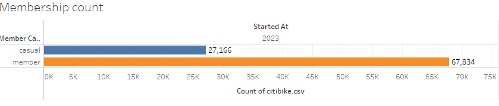

# Tableau_Challenge
Module_18 Assignment  Tableau_challenge

#### By _**Navyasri Pusuluri**_

## Tools Used

* _Jupyter notebook_
* _Git Bash_
* _Tableau_

## Modules Used

* _pandas_
* _datetime_
* _Tableau_

## Deployment
* Please find below the link to the Tableau citibike analysis:
  https://public.tableau.com/app/profile/navyasri.pusuluri/viz/Book2_16919038150020/Avg_Time?publish=yes

## Details of Assigments.

* All the analysis can be found at  main level below path Tableau_challenge.
* Data cleaning is done at citibike.ipynb.
* Tableau analysis can be found at citibike.twbx or posted the tableau link above.

## Data Source
* The data used in this analaysis is june2023 from the Citi Bike Data webpage.Subsequently,  established a Jupyter Notebook file, named "citibike.ipynb", to systematically clean and imported to Tableau as csv file.

## Questions used for the analysis
* How many trips have been recorded in total during the chosen period?
* What is the average elapsed time for a bike trip?

# Analysis
* Average time elapsed for rideable bike:

     
      
     This analysis shows more electric bikes used compare to classic bike in june2023.
  
* Top 10 Average time for start stations:

     
      
     This shows the highest average time used in liberty light rail station which is 24.20 and the lowest in Grove st. path station which is 8.54

* Elapsed time between start and end stations:
      
         
     This show the highest average time between Hoboken Terminal-Hudson st and Hudson pt and south waterfront walkway which is 147.5

* Elapsed time per day:
 
   
  
    This shows  sunday is the highest average time of 16.9 and the lowest on Tuesday which is 9.3

* Rideable count:

   
  
    This shows the count of classic bike is more than electric bike 

* Membership count:

   
  
    The count is higher at member type than the casual type

* Top 10 station count:

  
  
    This show the highest number of count is at Grove st path station and lowest count is 14 st Ferry-14 st& shipyard ln station.

* Total trips/day:

  

     This analysis says that Thrusday as the highest number of count and lowest count is on monday.

* Heat map between hours and days:

  
  
    This heat shows that on Thrusday at evening 6pm is  having the highest number of count.

* Bike count between start and end  stations:

  
  
     This shows the highest number of bike count is at between south Waterfront walkway and 12 st& sinatra dr N which is 440 bikes.

* Start station map:

  
  
  An analysis of the start station map highlights the concentration of the most frequently used stations in Jersey City, New Jersey, primarily in the zip codes 07302 and 07310. This suggests that the residents of Jersey City utilize the bicycle-sharing service extensively, potentially due to its cost-effectiveness when compared to other transportation options, such as taxis and ride-sharing services.

* End station map:    

   
  
  Similar to the start station map, the end station map also illustrates a notable concentration of the most frequently used stations in Jersey City, New Jersey, indicating that residents are likely utilizing the bicycle-sharing service for their commutes to and from work.

* Conclusion:

  In conclusion, this Tableau analysis provides a comprehensive overview of the trends and patterns in Citibike usage of june2023 . Through the creation of interactive dashboards and visualizations, key insights have been extracted and presented, highlighting trends in member type, Rideable type, as well as trip patterns based on hours and weekdays. One noteworthy phenomenon observed from the overall analysis is the high usage of the Citibike service by residents of Jersey City, New Jersey, primarily for commuting purposes.
                        
